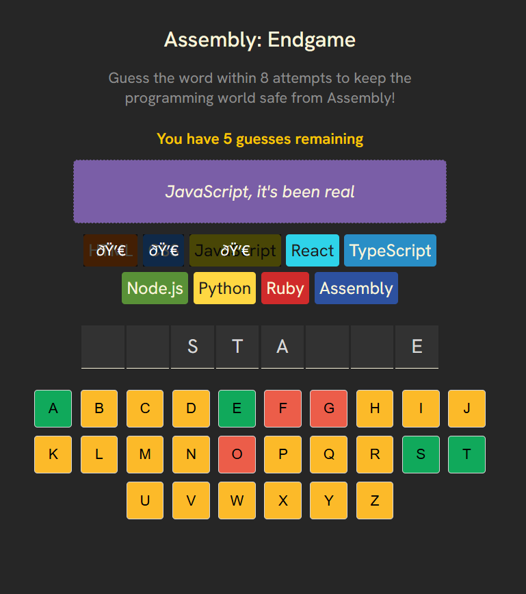

# 🎮 Assembly: Endgame

An interactive word-guessing game built with **React**. The game challenges players to guess a hidden programming-related word while trying to save the programming world from Assembly.

The project was built to strengthen and demonstrate practical React development skills, including **component-based architecture, state management, derived state, event handling, conditional rendering, accessibility, and responsive UI development**.

## 🚀 Live Demo

[Assembly: Endgame Demo](https://silver-fox-a1298a.netlify.app/)

## 📸 Preview

<!-- Add a screenshot or GIF of the application here -->



---

## ✨ Features

* 🎲 Randomly generated programming-related words
* ⌨️ Interactive on-screen keyboard
* 🔤 Dynamic letter guessing and word revelation
* ❤️ Limited number of incorrect guesses
* 🎉 Winning animation with confetti
* 💀 Losing state with the correct word revealed
* 🔄 New Game functionality
* 📢 Dynamic game-status feedback
* ♿ Accessibility-focused implementation
* 📱 Responsive user interface

---

## 🛠️ Tech Stack

### Frontend

* **React**
* **JavaScript (ES6+)**
* **HTML5**
* **CSS3**

### Libraries & Tools

* **React Confetti** — winning-state animation
* **clsx** — conditional CSS class management
* **nanoid** — unique identifier generation
* **Vite** — development and build tooling
* **Git & GitHub** — version control and project collaboration

---

## 🧩 React Concepts Demonstrated

This project was designed to apply core React concepts in a practical application.

### Component-Based Architecture

The application is divided into reusable components with clearly defined responsibilities:

```text
src/
├── components/
│   ├── GameStatus.jsx
│   ├── Keyboard.jsx
│   ├── LanguageElements.jsx
│   └── LetterElements.jsx
│
├── utils/
│   ├── languages.js
│   └── util.js
│
└── AssemblyEndgame.jsx
```

The main component manages the game state and logic, while child components are responsible for rendering specific parts of the interface.

### State Management

React's `useState` hook is used to manage the game's core state:


### Derived State

Important game conditions are derived from the existing state rather than being stored separately:

This avoids unnecessary state duplication and keeps the game logic predictable.

### Props & Component Communication

Data and event handlers are passed from parent components to child components using props.

### Conditional Rendering

Different UI states are rendered depending on the current game state:

### Conditional Styling

`clsx` is used to dynamically apply CSS classes based on the game state:

## ♿ Accessibility

Accessibility was considered as part of the development process rather than being added only at the end.

The application includes:

* Semantic HTML elements
* Native `<button>` elements for keyboard interactions
* Keyboard-accessible controls
* Visible focus states
* Appropriate ARIA attributes
* `aria-live` regions for dynamic game-status announcements
* Screen-reader-friendly game feedback
* Accessible communication of correct and incorrect guesses

Dynamic game information is communicated through an accessible status region:

---

## 🎯 Game Flow

```text
Start Game
    │
    ▼
Generate Random Word
    │
    ▼
Player Selects Letter
    │
    ├── Correct ──► Reveal Letter
    │
    └── Incorrect ──► Increment Wrong Guess Count
                            │
                            ▼
                     Eliminate Language
                            │
                ┌───────────┴───────────┐
                ▼                       ▼
           Word Complete          Guess Limit Reached
                │                       │
                ▼                       ▼
              WIN                     LOSE
                │                       │
                └───────────┬───────────┘
                            ▼
                       New Game
```

---

## 📂 Project Structure

```text
src/
│
├── components/
│   ├── GameStatus.jsx
│   ├── Keyboard.jsx
│   ├── LanguageElements.jsx
│   └── LetterElements.jsx
│
├── utils/
│   ├── languages.js
│   └── util.js
│
├── AssemblyEndgame.jsx
├── index.css
└── main.jsx
```

### Component Responsibilities

| Component          | Responsibility                            |
| ------------------ | ----------------------------------------- |
| `AssemblyEndgame`  | Game state and core game logic            |
| `GameStatus`       | Displays win, loss, and feedback messages |
| `LanguageElements` | Renders programming-language chips        |
| `LetterElements`   | Renders the hidden/guessed word           |
| `Keyboard`         | Handles player letter selection           |

---

## ⚙️ Getting Started

### Prerequisites

Make sure you have **Node.js** and **npm** installed.

### Clone the repository

```bash
git clone https://github.com/faseehfsh/assembly-endgame.git
cd assembly-endgame
```

### Install dependencies

```bash
npm install
```

### Start the development server

```bash
npm run dev
```

The application will be available at the local URL provided by Vite.

### Build for production

```bash
npm run build
```

---

## 🔮 Future Improvements

Potential future enhancements include:

* ⏱️ Time-based game mode
* 🎵 Optional sound effects
* 🎚️ Difficulty levels

---


## 👨‍💻 Author

**Mohomed Faseeh**

Computer Engineering Graduate
University of Peradeniya

[GitHub](https://github.com/faseehfsh) · [LinkedIn](https://www.linkedin.com/in/mohomedfaseeh/)

---
This project was part of Scrimba react course (https://scrimba.com/courses)
